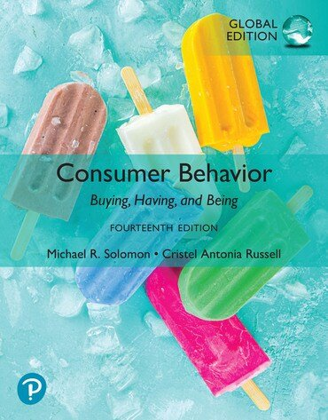
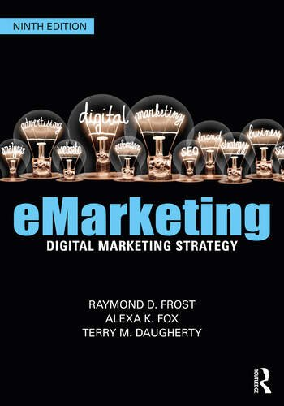
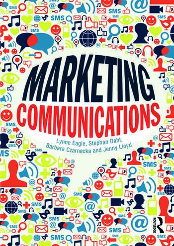
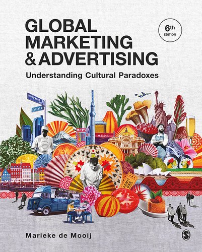
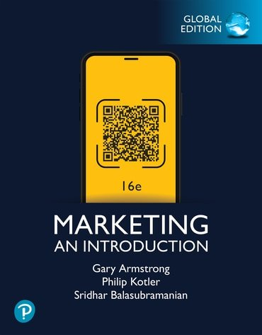
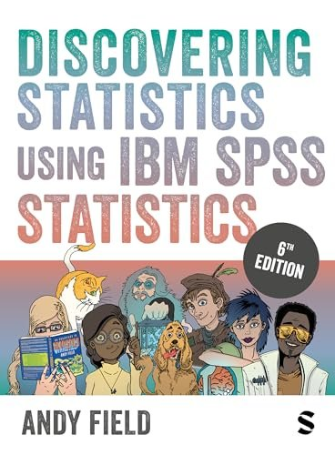
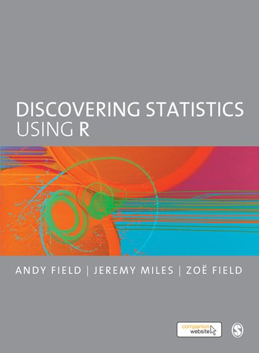
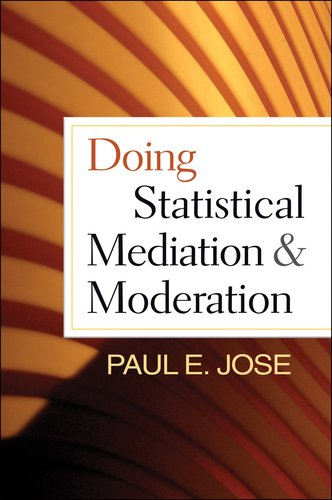

<!-- GENERATED from data/teaching.yml by scripts/build_teaching.py. Edit the data file. -->

```{=html}
<div class="t-wrap"><p class="t-intro">I teach marketing, consumer behaviour, digital marketing, advertising and quantitative research methods, in English, from first-year undergraduates to doctoral candidates. My courses follow leading international textbooks and are built around real market problems: students write complete marketing plans, design digital marketing strategies, run their own marketing research and, at doctoral level, estimate and test structural equation models with their own data.</p><nav class="t-strip" aria-label="Institutions"><a href="#gdansk-tech" class="t-strip-item"></a><a href="#rmit" class="t-strip-item"></a></nav><section class="t-portfolio"><h2>Course portfolio</h2><nav class="cp-nav" aria-label="Courses"><a href="#advertising">Advertising</a><a href="#consumer-behaviour">Consumer Behaviour</a><a href="#digital-marketing">Digital Marketing</a><a href="#international-advertising">International Advertising</a><a href="#principles-of-marketing">Principles of Marketing</a><a href="#marketing-research">Marketing Research</a><a href="#multivariate-research-methods">Multivariate Research Methods</a><a href="#research-methods-media-communication">Research Methods in Media and Communication</a><a href="#structural-equation-modelling">Structural Equation Modelling</a></nav><h3 class="cp-area">Marketing</h3><article class="cp-course" id="advertising"><div class="cp-main"><div class="cp-levels"><span class="cp-level">Undergraduate</span></div><h3>Advertising</h3><p class="cp-role">Course coordinator and instructor</p><p class="cp-sum">How advertising works and how it is managed: the theories behind persuasive messages, the work of agencies and creative teams, traditional and digital media, audiences and their values, regulation, and how to measure whether an advertisement worked.</p><details class="cp-outline"><summary>Course outline</summary><ol><li>Advertising as a message from the brand</li><li>Theories behind the message</li><li>Advertising agencies and how they work</li><li>Creative elements of advertisements</li><li>Traditional media</li><li>Digital and emerging media</li><li>Advertising and audience values</li><li>Offensive advertising and regulation</li><li>Evaluating advertising effectiveness</li><li>The future of advertising</li></ol></details><div class="cp-taught"><h4>Taught at</h4><ul><li><span><strong>Gdańsk Tech</strong> · 2012–2015</span></li></ul></div></div><div class="cp-books"><h4>Core textbook</h4><div class="cp-book-row"><a class="tb-link" href="https://www.routledge.com/Introduction-to-Advertising-Understanding-and-Managing-the-Advertising/Mogaji/p/book/9780367441999"><figure class="tb"><figcaption>Mogaji, E. (2021). <em>Introduction to advertising: Understanding and managing the advertising process</em>. Routledge.</figcaption></figure></a></div></div></article><article class="cp-course" id="consumer-behaviour"><div class="cp-main"><div class="cp-levels"><span class="cp-level">Undergraduate</span></div><h3>Consumer Behaviour</h3><p class="cp-role">Course coordinator and instructor</p><p class="cp-sum">Why people buy, use and dispose of products, and how culture, identity and social groups shape those choices. Students apply psychological and sociological models to real brands and international markets.</p><details class="cp-outline"><summary>Course outline</summary><ol><li>Buying, having and being: introduction to consumer behaviour</li><li>Consumer ethics, the marketplace and the planet</li><li>Perception and meaning</li><li>Learning, memory and knowledge</li><li>Motivation and values</li><li>Attitudes and how to change them</li><li>Decision making</li><li>Buying, using and disposing</li><li>Identity and the self</li><li>Personality, lifestyles and values</li><li>Social and cultural identity</li><li>Groups and social influence</li><li>Social class and status</li><li>Culture and consumption</li></ol></details><div class="cp-taught"><h4>Taught at</h4><ul><li><span><strong>Gdańsk Tech</strong> as “International Consumer Behaviour” · Management (International Business Management) · 2025–present</span></li></ul></div></div><div class="cp-books"><h4>Core textbook</h4><div class="cp-book-row"><a class="tb-link" href="https://www.pearson.com/en-gb/subject-catalog/p/consumer-behavior-global-edition/P200000010092/9781292452340"><figure class="tb"><figcaption>Solomon, M. R., &amp; Russell, C. A. (2024). <em>Consumer behavior: Buying, having, and being</em> (14th ed., global ed.). Pearson.</figcaption></figure></a></div></div></article><article class="cp-course" id="digital-marketing"><div class="cp-main"><div class="cp-levels"><span class="cp-level">Undergraduate</span></div><h3>Digital Marketing</h3><p class="cp-role">Course coordinator and instructor</p><p class="cp-sum">How to plan, run and measure digital marketing: online consumer behaviour, digital research, segmentation and positioning, the online marketing mix, and owned, paid and earned media. Students build a complete digital marketing plan for a new website or app.</p><details class="cp-outline"><summary>Course outline</summary><ol><li>Digital marketing: past, present and future</li><li>Strategic digital marketing and performance metrics</li><li>The digital marketing plan</li><li>Global digital marketing</li><li>Ethical and legal issues</li><li>Digital marketing research</li><li>Consumer behaviour online</li><li>Segmentation, targeting, differentiation and positioning</li><li>Product and price online</li><li>The internet for distribution</li><li>Owned media</li><li>Paid media</li><li>Earned media</li><li>Customer relationship management</li></ol></details><div class="cp-taught"><h4>Taught at</h4><ul><li><span><strong>Gdańsk Tech</strong> as “E-marketing and Trend Analysis” · Data Engineering (Big Data in Business Management) · 2025–present</span></li></ul></div></div><div class="cp-books"><h4>Core textbooks</h4><div class="cp-book-row"><a class="tb-link" href="https://www.routledge.com/product/isbn/9781032161495"><figure class="tb"><figcaption>Frost, R., Fox, A. K., &amp; Daugherty, T. (2023). <em>eMarketing: Digital marketing strategy</em> (9th ed.). Routledge.</figcaption></figure></a><figure class="tb"><figcaption>Eagle, L., Dahl, S., Czarnecka, B., &amp; Lloyd, J. (2015). <em>Marketing communications</em>. Routledge.</figcaption></figure></div></div></article><article class="cp-course" id="international-advertising"><div class="cp-main"><div class="cp-levels"><span class="cp-level">Master&#x27;s</span></div><h3>International Advertising</h3><p class="cp-role">Course coordinator and instructor</p><p class="cp-sum">How culture shapes advertising and global brand communication. Students analyse cultural values and communication styles across markets, examine the international business and media environment, and design and evaluate advertising strategies for brands competing internationally.</p><details class="cp-outline"><summary>Course outline</summary><ol><li>The paradoxes of global marketing communications</li><li>Global branding</li><li>Values and culture</li><li>Dimensions of national culture</li><li>Culture and consumer behaviour</li><li>Researching and applying cultural values</li><li>Culture and communication</li><li>Culture and the media</li><li>Culture and advertising appeals</li><li>Culture and executional style</li><li>From value paradox to international advertising strategy</li></ol></details><div class="cp-taught"><h4>Taught at</h4><ul><li><span><strong>RMIT</strong> · Master&#x27;s, School of Media and Communication</span></li></ul></div></div><div class="cp-books"><h4>Core textbook</h4><div class="cp-book-row"><a class="tb-link" href="https://collegepublishing.sagepub.com/products/274128"><figure class="tb"><figcaption>de Mooij, M. (2021). <em>Global marketing and advertising: Understanding cultural paradoxes</em> (6th ed.). Sage.</figcaption></figure></a></div></div></article><article class="cp-course" id="principles-of-marketing"><div class="cp-main"><div class="cp-levels"><span class="cp-level">Undergraduate</span><span class="cp-level">Master&#x27;s</span></div><h3>Principles of Marketing</h3><p class="cp-role">Course coordinator and instructor</p><p class="cp-sum">The foundations of marketing: creating customer value and engagement, understanding markets and buyers, and designing the marketing mix. Students work in teams to write and present a complete marketing plan for a real company and a new product.</p><details class="cp-outline"><summary>Course outline</summary><ol><li>Creating customer value and engagement</li><li>Company and marketing strategy</li><li>The marketing environment</li><li>Marketing information and customer insights</li><li>Consumer and business buyer behaviour</li><li>Segmentation, targeting and positioning</li><li>Products, services and brands</li><li>New products and the product life cycle</li><li>Pricing</li><li>Marketing channels, retailing and wholesaling</li><li>Advertising and public relations</li><li>Personal selling and sales promotion</li><li>Digital marketing</li><li>The global marketplace</li><li>Sustainable marketing, social responsibility and ethics</li></ol></details><div class="cp-taught"><h4>Taught at</h4><ul><li><span><strong>Gdańsk Tech</strong> as “Essentials of Marketing” · Management (bachelor&#x27;s) · 2025–present</span></li><li><span><strong>Gdańsk Tech</strong> as “Marketing” · Management (master&#x27;s) · 2025–present</span></li><li><span><strong>Gdańsk Tech</strong> as “Marketing” · Data Engineering (bachelor&#x27;s) · 2025–present</span></li></ul></div></div><div class="cp-books"><h4>Core textbook</h4><div class="cp-book-row"><a class="tb-link" href="https://www.pearson.com/en-gb/subject-catalog/p/marketing-an-introduction-global-edition/P200000013770/9781292753492"><figure class="tb"><figcaption>Armstrong, G., Kotler, P., &amp; Balasubramanian, S. (2025). <em>Marketing: An introduction</em> (16th ed., global ed.). Pearson.</figcaption></figure></a></div></div></article><h3 class="cp-area">Research methods</h3><article class="cp-course" id="marketing-research"><div class="cp-main"><div class="cp-levels"><span class="cp-level">Undergraduate</span></div><h3>Marketing Research</h3><p class="cp-role">Course coordinator and instructor</p><p class="cp-sum">How to plan and carry out a marketing research project from problem to report. Students test a new product concept with their own survey: they design the questionnaire, choose the sample, collect and code the data, analyse it and write up the results.</p><details class="cp-outline"><summary>Course outline</summary><ol><li>The nature and types of marketing research</li><li>The research process and research design</li><li>Measurement and levels of measurement</li><li>Questionnaire design</li><li>Measuring attitudes</li><li>Sampling</li><li>Data editing, coding and preparation</li><li>Descriptive and bivariate analysis</li><li>Multivariate analysis, including cluster analysis</li><li>Qualitative interviews and projective techniques</li><li>Observation and survey procedures</li><li>Research ethics and the research report</li></ol></details><div class="cp-taught"><h4>Taught at</h4><ul><li><span><strong>Gdańsk Tech</strong> · Bachelor&#x27;s programmes</span></li></ul></div></div><div class="cp-books"><h4>Core textbook</h4><div class="cp-book-row"><figure class="tb"><div class="tb-plain" role="img" aria-label="Marketing research: Methodological foundations"><span>Marketing research: Methodological foundations</span></div><figcaption>Iacobucci, D., &amp; Churchill, G. A. (2015). <em>Marketing research: Methodological foundations</em> (11th ed.). Earlie Lite Books.</figcaption></figure></div></div></article><article class="cp-course" id="multivariate-research-methods"><div class="cp-main"><div class="cp-levels"><span class="cp-level">Doctoral</span></div><h3>Multivariate Research Methods</h3><p class="cp-role">Course coordinator and instructor</p><p class="cp-sum">Doctoral training in the multivariate techniques most used in social-science and business research, from data screening to factor analysis, regression-based models and an introduction to structural equation modelling.</p><details class="cp-outline"><summary>Course outline</summary><ol><li>Overview of multivariate methods</li><li>Examining your data: missing values, outliers and assumptions</li><li>Exploratory factor analysis</li><li>Cluster analysis</li><li>Multiple regression</li><li>MANOVA</li><li>Discriminant analysis and logistic regression</li><li>Introduction to structural equation modelling</li><li>Confirmatory factor analysis</li></ol></details><div class="cp-taught"><h4>Taught at</h4><ul><li><span><strong>Gdańsk Tech</strong> · Doctoral School, years 1–2</span></li></ul></div></div><div class="cp-books"><h4>Core textbook</h4><div class="cp-book-row"><figure class="tb"><figcaption>Hair, J. F., Black, W. C., Babin, B. J., &amp; Anderson, R. E. (2019). <em>Multivariate data analysis</em> (8th ed.). Cengage.</figcaption></figure></div></div></article><article class="cp-course" id="research-methods-media-communication"><div class="cp-main"><div class="cp-levels"><span class="cp-level">Master&#x27;s</span></div><h3>Research Methods in Media and Communication</h3><p class="cp-role">Course coordinator and instructor</p><p class="cp-sum">How to design and carry out a research project in media and communication, from research question and proposal to data analysis. Students learn quantitative analysis hands-on in both IBM SPSS Statistics and R, and finish with a research plan for their capstone project.</p><details class="cp-outline"><summary>Course outline</summary><ol><li>Research problems, questions and proposals</li><li>Finding and evaluating the literature</li><li>Research design and the logic of statistics</li><li>Data, variables and visualisation in SPSS and R</li><li>Bias, assumptions and data screening</li><li>Correlation</li><li>Linear regression</li><li>Comparing two means</li><li>Moderation and mediation</li><li>Comparing several means: ANOVA, ANCOVA and factorial designs</li><li>Exploratory factor analysis and reliability</li><li>Categorical outcomes: chi-square and logistic regression</li><li>Writing the research plan</li></ol></details><div class="cp-taught"><h4>Taught at</h4><ul><li><span><strong>RMIT</strong> · Master&#x27;s, School of Media and Communication</span></li></ul></div></div><div class="cp-books"><h4>Core textbooks</h4><div class="cp-book-row"><figure class="tb"><figcaption>Field, A. (2024). <em>Discovering statistics using IBM SPSS Statistics</em> (6th ed.). Sage.</figcaption></figure><figure class="tb"><figcaption>Field, A., Miles, J., &amp; Field, Z. (2012). <em>Discovering statistics using R</em>. Sage.</figcaption></figure></div></div></article><article class="cp-course" id="structural-equation-modelling"><div class="cp-main"><div class="cp-levels"><span class="cp-level">Doctoral</span></div><h3>Structural Equation Modelling</h3><p class="cp-role">Course coordinator and instructor</p><p class="cp-sum">A doctoral course on specifying, estimating, testing and reporting structural equation models: measurement models, structural paths, model fit, group comparisons and measurement invariance, and mediation and moderation.</p><details class="cp-outline"><summary>Course outline</summary><ol><li>SEM: promise, problems and reporting standards</li><li>Data preparation and software</li><li>Causal models and path analysis</li><li>Estimation, model testing and fit</li><li>Comparing models and groups</li><li>Confirmatory factor analysis</li><li>Structural regression models</li><li>Mediation and moderation</li><li>Moderated mediation and mediated moderation</li><li>Measurement invariance</li><li>Best practices in SEM</li></ol></details><div class="cp-taught"><h4>Taught at</h4><ul><li><span><strong>Gdańsk Tech</strong> · Doctoral School, years 1–2</span></li></ul></div></div><div class="cp-books"><h4>Core textbooks</h4><div class="cp-book-row"><a class="tb-link" href="https://www.guilford.com/books/Principles-and-Practice-of-Structural-Equation-Modeling/Rex-Kline/9781462551910"><figure class="tb"><figcaption>Kline, R. B. (2023). <em>Principles and practice of structural equation modeling</em> (5th ed.). Guilford Press.</figcaption></figure></a><figure class="tb"><figcaption>Hair, J. F., Black, W. C., Babin, B. J., &amp; Anderson, R. E. (2019). <em>Multivariate data analysis</em> (8th ed.). Cengage.</figcaption></figure><a class="tb-link" href="https://www.guilford.com/books/Doing-Statistical-Mediation-and-Moderation/Paul-Jose/9781462508150"><figure class="tb"><figcaption>Jose, P. E. (2013). <em>Doing statistical mediation and moderation</em>. Guilford Press.</figcaption></figure></a></div></div></article></section><section class="t-insts"><h2>Where I have taught</h2><article class="t-inst" id="gdansk-tech"><div><h3>Gdańsk University of Technology</h3><p class="t-inst-sub">Politechnika Gdańska · Poland</p><ul class="t-roles"><li><span>Associate Professor of Marketing</span><span class="tr-years">2025–present</span></li><li><span>Lecturer in Marketing</span><span class="tr-years">2014–2015</span></li><li><span>Sessional Lecturer</span><span class="tr-years">2012–2014</span></li></ul><p class="t-inst-units">Faculty of Management and Economics · Faculty of Electronics, Telecommunications and Informatics · Doctoral School</p><p class="t-inst-courses"><strong>Courses:</strong> <a href="#advertising">Advertising</a>, <a href="#consumer-behaviour">Consumer Behaviour</a>, <a href="#digital-marketing">Digital Marketing</a>, <a href="#marketing-research">Marketing Research</a>, <a href="#multivariate-research-methods">Multivariate Research Methods</a>, <a href="#principles-of-marketing">Principles of Marketing</a>, <a href="#structural-equation-modelling">Structural Equation Modelling</a></p></div></article><article class="t-inst" id="rmit"><div><h3>RMIT University</h3><p class="t-inst-sub">Melbourne, Australia</p><ul class="t-roles"><li><span>Associate Professor in Advertising</span><span class="tr-years">2025–2026</span></li><li><span>Senior Lecturer in Advertising</span><span class="tr-years">2019–2024</span></li></ul><p class="t-inst-units">School of Media and Communication</p><p class="t-inst-courses"><strong>Courses:</strong> <a href="#international-advertising">International Advertising</a>, <a href="#research-methods-media-communication">Research Methods in Media and Communication</a></p></div></article></section><section class="t-invite"><h2>Visiting teaching and guest lectures</h2><p>I welcome invitations to teach as a visiting professor, run intensive courses, give guest lectures, and lead doctoral workshops on structural equation modelling and survey research methods.</p><a class="btn-invite" href="https://www.linkedin.com/in/bruno-schivinski-b2baa044">Contact me on LinkedIn</a></section></div>
```
