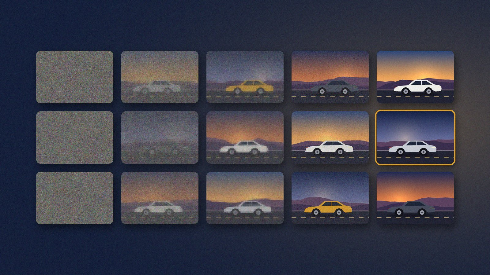

<!-- GENERATED from watch/issues/2026-01-12-generative-ai-ad-images.yml by scripts/build_watch.py. Edit the data file. -->

```{=html}
<p class="mw-kicker">Marketing Watch · Issue 1 · Week of 12 January 2026</p>
<figure class="mw-hero"><figcaption>Image models start from noise and refine it into a picture. Trained on the best-rated car ads, they turn out many usable ad variants. Illustration made for Marketing Watch.</figcaption></figure>
<section class="mw-answer" aria-label="Short answer"><h2>The short answer</h2><p>Yes, for mainstream products. When researchers fine-tuned an open-source image model on the 30 best-rated car ads in a set of 543, the ads it produced scored higher with consumers than conventional ads and earned a 49% higher click-through rate than the brand&#x27;s own ads on Meta. Plain prompting did not get there, and the approach failed for a highly distinctive product.</p></section>
<section class="mw-takeaways"><h2>Key takeaways</h2><ul><li>Fine-tuned AI ads scored 4.55 out of 7 on attention, interest, desire and action, against 3.79 for conventional car ads; 47 of 50 AI ads beat the conventional average.</li><li>On Meta, AI ads drew a 2.04% click-through rate against 1.37% for the brand&#x27;s real ads (28,775 impressions); on Taboola, 1.41% against 0.64%.</li><li>What made the difference was training on the category&#x27;s best-performing ads. Prompting an off-the-shelf model, or training on random ads, did no better than the brand&#x27;s own ads.</li><li>It worked for an unknown brand and for sunscreen, not only cars. It did not work for a niche, highly differentiated car, and it could not make ads funny.</li></ul></section>
<section id="what-the-researchers-did"><h2>What the researchers did</h2><p>Mark Heitmann, Tijmen Jansen, Martin Reisenbichler and David Schweidel asked a question many marketing teams
are asking: can an image model produce ads that work as well as ads made the conventional way? Their answer
comes from seven studies, mostly on cars, with checks on sunscreen and dog care.</p><p>They started from 211,429 online ads and found 543 paid car ads. 572 potential car buyers rated these ads on
the four classic funnel stages: attention, interest, desire and action (AIDA), on 1–7 scales. The team then
took the 30 best-rated ads, added about two dozen product photos of the Polestar 3 (a car the model had never
seen), and fine-tuned the open-source model Stable Diffusion on both. Each concept got its own trigger word,
so a single prompt could ask for &quot;a high-AIDA web banner ad of a Polestar 3&quot;.</p><p>The model then produced 50 ads with no human editing and no prompt crafting. Another 569 car buyers rated
them alongside the competitors&#x27; ads and Polestar&#x27;s own ads, more than 20,000 ratings in all.</p>
<dl class="mw-facts"><div><dt>Data</dt><dd>543 paid car ads, rated by 572 car buyers</dd></div><div><dt>Model</dt><dd>Stable Diffusion 2.1, fine-tuned on the 30 top-rated ads plus 23 product photos</dd></div><div><dt>Output</dt><dd>50 AI ads, used as generated</dd></div><div><dt>Tests</dt><dd>7 studies; surveys with 127 to 998 people each, plus Meta and Taboola field tests</dd></div></dl>
</section>
<section id="what-they-found"><h2>What they found</h2><p>The AI ads won on average. They scored 4.55 against 3.79 for competitors&#x27; ads and 3.80 for Polestar&#x27;s own
ads. Only 3 of the 50 AI ads fell below the conventional average, so a randomly picked AI ad was very likely
to be at least as good as a typical human-made one. The best human-made ad (5.57) still beat the average AI
ad, but the best AI ad scored higher still (6.00).</p><p>This was not just prettier pictures. The researchers scored every image for aesthetic quality: the most
beautiful conventional ads scored lower on AIDA than the AI ads, and aesthetics explained only about 15% of
the AI advantage. People were also more willing to share the AI ads (4.84 against 3.98 for competitors).</p>
<figure class="mw-chart" id="chart-aida"><figcaption class="mw-chart-title">Average rating across attention, interest, desire and action</figcaption><div class="mw-chart-svg"><svg viewBox="0 0 680 154" role="img" aria-labelledby="chart-aida-t" font-family="Hanken Grotesk, Arial, sans-serif"><title id="chart-aida-t">Average rating across attention, interest, desire and action</title><line x1="250.0" y1="4" x2="250.0" y2="128" stroke="#dde1e8" stroke-width="1"/><text x="250.0" y="146" font-size="12" text-anchor="middle" fill="#5b6476">1</text><line x1="310.0" y1="4" x2="310.0" y2="128" stroke="#dde1e8" stroke-width="1"/><text x="310.0" y="146" font-size="12" text-anchor="middle" fill="#5b6476">2</text><line x1="370.0" y1="4" x2="370.0" y2="128" stroke="#dde1e8" stroke-width="1"/><text x="370.0" y="146" font-size="12" text-anchor="middle" fill="#5b6476">3</text><line x1="430.0" y1="4" x2="430.0" y2="128" stroke="#dde1e8" stroke-width="1"/><text x="430.0" y="146" font-size="12" text-anchor="middle" fill="#5b6476">4</text><line x1="490.0" y1="4" x2="490.0" y2="128" stroke="#dde1e8" stroke-width="1"/><text x="490.0" y="146" font-size="12" text-anchor="middle" fill="#5b6476">5</text><line x1="550.0" y1="4" x2="550.0" y2="128" stroke="#dde1e8" stroke-width="1"/><text x="550.0" y="146" font-size="12" text-anchor="middle" fill="#5b6476">6</text><line x1="610.0" y1="4" x2="610.0" y2="128" stroke="#dde1e8" stroke-width="1"/><text x="610.0" y="146" font-size="12" text-anchor="middle" fill="#5b6476">7</text><g><title>Competitors&#x27; car ads (543): 3.79 out of 7</title><text x="238" y="27" font-size="13.5" text-anchor="end" fill="#15203b">Competitors&#x27; car ads (543)</text><rect x="250" y="12" width="167.4" height="22" rx="4" fill="#aab3c5"/><text x="425.4" y="28" font-size="13.5" fill="#15203b">3.79</text></g><g><title>Polestar&#x27;s own ads (10): 3.80 out of 7</title><text x="238" y="67" font-size="13.5" text-anchor="end" fill="#15203b">Polestar&#x27;s own ads (10)</text><rect x="250" y="52" width="168.0" height="22" rx="4" fill="#aab3c5"/><text x="426.0" y="68" font-size="13.5" fill="#15203b">3.80</text></g><g><title>AI ads, fine-tuned on top ads (50): 4.55 out of 7</title><text x="238" y="107" font-size="13.5" text-anchor="end" fill="#15203b" font-weight="600">AI ads, fine-tuned on top ads (50)</text><rect x="250" y="92" width="213.0" height="22" rx="4" fill="#e0a12a"/><text x="471.0" y="108" font-size="13.5" fill="#15203b" font-weight="600">4.55</text></g></svg></div><div class="mw-sr"><table><caption>Average rating across attention, interest, desire and action</caption><tr><th>Group</th><th>Value (out of 7)</th></tr><tr><th scope="row">Competitors&#x27; car ads (543)</th><td>3.79</td></tr><tr><th scope="row">Polestar&#x27;s own ads (10)</th><td>3.8</td></tr><tr><th scope="row">AI ads, fine-tuned on top ads (50)</th><td>4.55</td></tr></table></div><p class="mw-chart-src">Study 1, 569 potential car buyers, 1–7 scales.</p></figure>
</section>
<section id="did-it-work-outside-the-survey"><h2>Did it work outside the survey?</h2><p>Yes. In a four-day A/B test on Meta, five AI ads and five real Polestar ads ran with the same caption, the same
audience (US adults aged 25 to 65 interested in cars) and a $5 daily budget per ad. The AI ads drew more
clicks: 2.04% against 1.37%, a 49% lift. A second test on Taboola showed the same pattern (1.41% against 0.64%).
The authors note that field tests give less control than surveys and that results will vary by platform.</p>
<figure class="mw-chart" id="chart-ctr"><figcaption class="mw-chart-title">Click-through rate in live tests, real ads vs AI ads</figcaption><div class="mw-chart-svg"><svg viewBox="0 0 680 194" role="img" aria-labelledby="chart-ctr-t" font-family="Hanken Grotesk, Arial, sans-serif"><title id="chart-ctr-t">Click-through rate in live tests, real ads vs AI ads</title><line x1="250.0" y1="4" x2="250.0" y2="168" stroke="#dde1e8" stroke-width="1"/><text x="250.0" y="186" font-size="12" text-anchor="middle" fill="#5b6476">0</text><line x1="310.0" y1="4" x2="310.0" y2="168" stroke="#dde1e8" stroke-width="1"/><text x="310.0" y="186" font-size="12" text-anchor="middle" fill="#5b6476">0.5</text><line x1="370.0" y1="4" x2="370.0" y2="168" stroke="#dde1e8" stroke-width="1"/><text x="370.0" y="186" font-size="12" text-anchor="middle" fill="#5b6476">1</text><line x1="430.0" y1="4" x2="430.0" y2="168" stroke="#dde1e8" stroke-width="1"/><text x="430.0" y="186" font-size="12" text-anchor="middle" fill="#5b6476">1.5</text><line x1="490.0" y1="4" x2="490.0" y2="168" stroke="#dde1e8" stroke-width="1"/><text x="490.0" y="186" font-size="12" text-anchor="middle" fill="#5b6476">2</text><line x1="550.0" y1="4" x2="550.0" y2="168" stroke="#dde1e8" stroke-width="1"/><text x="550.0" y="186" font-size="12" text-anchor="middle" fill="#5b6476">2.5</text><line x1="610.0" y1="4" x2="610.0" y2="168" stroke="#dde1e8" stroke-width="1"/><text x="610.0" y="186" font-size="12" text-anchor="middle" fill="#5b6476">3</text><g><title>Meta: Polestar&#x27;s own ads: 1.37%</title><text x="238" y="27" font-size="13.5" text-anchor="end" fill="#15203b">Meta: Polestar&#x27;s own ads</text><rect x="250" y="12" width="164.4" height="22" rx="4" fill="#aab3c5"/><text x="422.4" y="28" font-size="13.5" fill="#15203b">1.37%</text></g><g><title>Meta: AI ads: 2.04%</title><text x="238" y="67" font-size="13.5" text-anchor="end" fill="#15203b" font-weight="600">Meta: AI ads</text><rect x="250" y="52" width="244.8" height="22" rx="4" fill="#e0a12a"/><text x="502.8" y="68" font-size="13.5" fill="#15203b" font-weight="600">2.04%</text></g><g><title>Taboola: Polestar&#x27;s own ads: 0.64%</title><text x="238" y="107" font-size="13.5" text-anchor="end" fill="#15203b">Taboola: Polestar&#x27;s own ads</text><rect x="250" y="92" width="76.8" height="22" rx="4" fill="#aab3c5"/><text x="334.8" y="108" font-size="13.5" fill="#15203b">0.64%</text></g><g><title>Taboola: AI ads: 1.41%</title><text x="238" y="147" font-size="13.5" text-anchor="end" fill="#15203b" font-weight="600">Taboola: AI ads</text><rect x="250" y="132" width="169.2" height="22" rx="4" fill="#e0a12a"/><text x="427.2" y="148" font-size="13.5" fill="#15203b" font-weight="600">1.41%</text></g></svg></div><div class="mw-sr"><table><caption>Click-through rate in live tests, real ads vs AI ads</caption><tr><th>Group</th><th>Value (%)</th></tr><tr><th scope="row">Meta: Polestar&#x27;s own ads</th><td>1.37</td></tr><tr><th scope="row">Meta: AI ads</th><td>2.04</td></tr><tr><th scope="row">Taboola: Polestar&#x27;s own ads</th><td>0.64</td></tr><tr><th scope="row">Taboola: AI ads</th><td>1.41</td></tr></table></div><p class="mw-chart-src">Study 3. Meta: 28,775 impressions, 496 clicks, 1–4 February 2025.</p></figure>
</section>
<section id="how-you-use-the-ai-matters-more-than-which-ai"><h2>How you use the AI matters more than which AI</h2><p>The most useful finding for practice comes from Study 4. The team compared four ways of using the same model.
Simply prompting it for &quot;an engaging web banner ad&quot; scored 3.99. Training it on randomly chosen ads from the
category scored 3.82, about the market average. Training it on the best ads while also telling it to avoid the
worst ones scored 4.21. Only training on the best-rated ads reached 4.61, the one approach that beat the
brand&#x27;s own ads (4.35).</p><p>In other words, the model has to learn what works with your customers, not just what ads in your category
look like. That takes one round of consumer ratings at the start; after that, new variants cost almost nothing.</p>
<figure class="mw-chart" id="chart-approaches"><figcaption class="mw-chart-title">Same model, four ways of using it: average funnel rating</figcaption><div class="mw-chart-svg"><svg viewBox="0 0 680 274" role="img" aria-labelledby="chart-approaches-t" font-family="Hanken Grotesk, Arial, sans-serif"><title id="chart-approaches-t">Same model, four ways of using it: average funnel rating</title><line x1="250.0" y1="4" x2="250.0" y2="248" stroke="#dde1e8" stroke-width="1"/><text x="250.0" y="266" font-size="12" text-anchor="middle" fill="#5b6476">1</text><line x1="310.0" y1="4" x2="310.0" y2="248" stroke="#dde1e8" stroke-width="1"/><text x="310.0" y="266" font-size="12" text-anchor="middle" fill="#5b6476">2</text><line x1="370.0" y1="4" x2="370.0" y2="248" stroke="#dde1e8" stroke-width="1"/><text x="370.0" y="266" font-size="12" text-anchor="middle" fill="#5b6476">3</text><line x1="430.0" y1="4" x2="430.0" y2="248" stroke="#dde1e8" stroke-width="1"/><text x="430.0" y="266" font-size="12" text-anchor="middle" fill="#5b6476">4</text><line x1="490.0" y1="4" x2="490.0" y2="248" stroke="#dde1e8" stroke-width="1"/><text x="490.0" y="266" font-size="12" text-anchor="middle" fill="#5b6476">5</text><line x1="550.0" y1="4" x2="550.0" y2="248" stroke="#dde1e8" stroke-width="1"/><text x="550.0" y="266" font-size="12" text-anchor="middle" fill="#5b6476">6</text><line x1="610.0" y1="4" x2="610.0" y2="248" stroke="#dde1e8" stroke-width="1"/><text x="610.0" y="266" font-size="12" text-anchor="middle" fill="#5b6476">7</text><g><title>Competitors&#x27; ads: 3.48 out of 7</title><text x="238" y="27" font-size="13.5" text-anchor="end" fill="#15203b">Competitors&#x27; ads</text><rect x="250" y="12" width="148.8" height="22" rx="4" fill="#aab3c5"/><text x="406.8" y="28" font-size="13.5" fill="#15203b">3.48</text></g><g><title>Trained on random category ads: 3.82 out of 7</title><text x="238" y="67" font-size="13.5" text-anchor="end" fill="#15203b">Trained on random category ads</text><rect x="250" y="52" width="169.2" height="22" rx="4" fill="#aab3c5"/><text x="427.2" y="68" font-size="13.5" fill="#15203b">3.82</text></g><g><title>Prompted, no ad training: 3.99 out of 7</title><text x="238" y="107" font-size="13.5" text-anchor="end" fill="#15203b">Prompted, no ad training</text><rect x="250" y="92" width="179.4" height="22" rx="4" fill="#aab3c5"/><text x="437.4" y="108" font-size="13.5" fill="#15203b">3.99</text></g><g><title>Trained on best and worst ads: 4.21 out of 7</title><text x="238" y="147" font-size="13.5" text-anchor="end" fill="#15203b">Trained on best and worst ads</text><rect x="250" y="132" width="192.6" height="22" rx="4" fill="#aab3c5"/><text x="450.6" y="148" font-size="13.5" fill="#15203b">4.21</text></g><g><title>Polestar&#x27;s own ads: 4.35 out of 7</title><text x="238" y="187" font-size="13.5" text-anchor="end" fill="#15203b">Polestar&#x27;s own ads</text><rect x="250" y="172" width="201.0" height="22" rx="4" fill="#aab3c5"/><text x="459.0" y="188" font-size="13.5" fill="#15203b">4.35</text></g><g><title>Trained on the best-rated ads: 4.61 out of 7</title><text x="238" y="227" font-size="13.5" text-anchor="end" fill="#15203b" font-weight="600">Trained on the best-rated ads</text><rect x="250" y="212" width="216.6" height="22" rx="4" fill="#e0a12a"/><text x="474.6" y="228" font-size="13.5" fill="#15203b" font-weight="600">4.61</text></g></svg></div><div class="mw-sr"><table><caption>Same model, four ways of using it: average funnel rating</caption><tr><th>Group</th><th>Value (out of 7)</th></tr><tr><th scope="row">Competitors&#x27; ads</th><td>3.48</td></tr><tr><th scope="row">Trained on random category ads</th><td>3.82</td></tr><tr><th scope="row">Prompted, no ad training</th><td>3.99</td></tr><tr><th scope="row">Trained on best and worst ads</th><td>4.21</td></tr><tr><th scope="row">Polestar&#x27;s own ads</th><td>4.35</td></tr><tr><th scope="row">Trained on the best-rated ads</th><td>4.61</td></tr></table></div><p class="mw-chart-src">Study 4, 359 potential car buyers, 1–7 scales.</p></figure>
</section>
<section id="brand-personality-and-targeting"><h2>Brand personality and targeting</h2><p>The model can also carry a brand image. Adding about 24 Flickr images tagged &quot;rugged&quot; or &quot;luxurious&quot; to the
training produced ads that looked more rugged (4.91 against 4.09 for Polestar&#x27;s ads) or more luxurious (5.44
against 4.50), with no loss on the funnel measures.</p><p>There is a catch for targeting. Rugged-style ads did nothing for the average viewer (4.95 against 4.84), but
they lifted brand liking among people who want a rugged car and lowered it among people who do not. A
personality-tuned version should go to the segment that values that trait, not to everyone.</p>
</section>
<section id="how-to-apply-it"><h2>How to apply it</h2><ol class="mw-steps"><li><strong>Collect your category&#x27;s ads.</strong> Gather a few hundred current paid ads in your category: yours and competitors&#x27;. Remove text and logos so the model learns imagery, not words.</li><li><strong>Rate them once with real customers.</strong> Ask target customers to rate each ad on attention, interest, desire and action (1–7). Five or more ratings per ad were enough in this study.</li><li><strong>Keep the top 30.</strong> Fine-tune on the 30 best-rated ads, not on a random sample and not on a mix of best and worst. This was the decisive step.</li><li><strong>Teach it your product.</strong> Add 11 to 24 clean product photos from several angles, background removed, so the product is drawn accurately.</li><li><strong>Add a brand trait if you need one.</strong> For a personality such as rugged or luxurious, add about two dozen images that express it, under its own trigger word.</li><li><strong>Generate many, check, then test live.</strong> Produce dozens of variants, screen out distortions, and A/B test the best against your current creative before scaling.</li></ol></section>
<section id="what-to-expect"><h2>What to expect</h2><ul class="mw-list"><li><strong>A better average, not a guaranteed winner.</strong> AI ads beat the typical conventional ad by about 0.75 points on a 7-point scale; your best human ads can still win.</li><li><strong>Lower cost per variant.</strong> The authors cite $2,000 to $4,000 for a simple stock-based ad and up to $50,000 for a professional shoot. After the one-off rating and training, extra variants cost little, which helps fight ad fatigue.</li><li><strong>A click-through lift worth testing, not banking.</strong> The 49% lift came from a small four-day test with one car. Treat it as a reason to run your own A/B test.</li><li><strong>Stable settings.</strong> The same training settings worked for cars and sunscreen, so the process can be standardised once set up.</li></ul></section>
<section id="where-it-does-not-work"><h2>Where it does not work</h2><ul class="mw-list"><li><strong>Distinctive products.</strong> For the Smart Fortwo, a niche two-seater sold on surprise and city agility, AI ads scored slightly below the real ads (3.62 against 3.81). The model learns the category average; it cannot invent an unusual angle.</li><li><strong>Humour and surprise.</strong> Trained on funny dog-care ads, the model kept good funnel scores but could not make ads funny. Pedigree&#x27;s real humorous ad was recognised more often than its AI version (85% against 70%).</li><li><strong>Sameness.</strong> AI ads in a category looked alike: similar roads for cars, the same Monstera leaves in sunscreen ads. If every competitor trains on the same winners, ads may converge and lose impact.</li><li><strong>Fit with the goal.</strong> The model improves what it is trained on. It did not raise recall or recognition beyond conventional ads, because it was never trained on them.</li></ul></section>
<section id="questions"><h2>Questions marketers ask</h2><div class="mw-faq"><h3>Can generative AI make ads that perform better than human-made ads?</h3><p>In this Journal of Marketing study, yes on average: fine-tuned AI ads scored 4.55 out of 7 on attention, interest, desire and action, against 3.79 for conventional car ads, and earned a 49% higher click-through rate on Meta than the brand&#x27;s real ads. The best human-made ads can still beat the average AI ad.</p></div><div class="mw-faq"><h3>Is prompting an image generator enough to get good ads?</h3><p>Not in this study. Prompting Stable Diffusion for an engaging banner ad scored 3.99, below the brand&#x27;s own ads (4.35). Only fine-tuning the model on the 30 best-rated ads in the category beat them (4.61).</p></div><div class="mw-faq"><h3>How much data do you need to fine-tune an image model for ads?</h3><p>The researchers used the 30 top-rated ads from a set of 543 rated by consumers, 11 to 24 product photos, and about 24 images per brand personality trait. The consumer ratings are collected once.</p></div><div class="mw-faq"><h3>When does AI-generated advertising not work?</h3><p>It worked less well for a highly differentiated niche product, could not create humour, and tended to produce similar-looking ads. It suits mainstream products and goals built on familiarity and trust.</p></div><div class="mw-faq"><h3>Does it only work for well-known brands?</h3><p>No. AI ads for NIO, a brand unknown to the study&#x27;s participants, scored 4.94 against 4.02 for NIO&#x27;s real ads, and AI sunscreen ads beat both competitors and the brand&#x27;s own ads.</p></div></section>
<section id="also-new"><h2>Also new this week</h2><div class="mw-also"><article><p class="mw-also-src"><em>Journal of Advertising</em> · 2026</p><h3><a href="https://doi.org/10.1080/00913367.2025.2593660">The power of real: Exploring the effects of AI-generated vs. real models in advertising considering female consumers</a></h3><p class="mw-also-au">Khodakarami, F., Peter, P. C., &amp; Cornelis, E.</p><p>The counterpoint to this week&#x27;s lead: in three experiments, women rated a model as less attractive, and liked the ad less, when a disclaimer said the model was AI-generated rather than real. The label triggered resistance and made the model feel more distant, for Gen Z and Gen X women alike. If you use AI-generated people and must disclose it, test how your audience reacts to the label itself.</p></article><article><p class="mw-also-src"><em>Psychology &amp; Marketing</em> · 2026</p><h3><a href="https://doi.org/10.1002/mar.70102">Can AI models be used to generate high-quality pictorial stimuli for consumer behavior change interventions?</a></h3><p class="mw-also-au">Chen, Q., Greene, D., Liang, Y., Portmann, M., &amp; Dolnicar, S.</p><p>In an online experiment with 995 people, images made by AI models were rated more accurate, more appealing and more emotionally clear than images made by human designers, and people struggled to tell them apart. ChatGPT-4o was best at consistent sets in a simple style; complex emotions such as envy were still hard to draw. Useful for teams that need many controlled visual variants for testing.</p></article></div></section>
<section id="source" class="mw-source"><h2>Source</h2><p class="mw-cite">Heitmann, M., Jansen, T. P. J., Reisenbichler, M., &amp; Schweidel, D. A. (2026). Picture perfect: Engaging customers with visual generative AI. <em>Journal of Marketing</em>, <em>90</em>(4), 74–96. <a href="https://doi.org/10.1177/00222429251356993">https://doi.org/10.1177/00222429251356993</a></p><p class="mw-note">This brief is written for practitioners from the published article. Open access (CC BY 4.0): free to read at the publisher. Numbers are as reported by the authors; read the article for full methods.</p></section>
<div class="mw-author"><div><p><strong>Bruno Schivinski</strong> is Associate Professor of Marketing at Gdańsk University of Technology. He studies how consumers engage with brands in digital and social media.</p><p><a href="../../../index.html">About Bruno</a> · <a href="../../index.html">All Marketing Watch issues</a> · <a href="../../index.xml">RSS feed</a></p></div></div>
<p class="mw-published">Published 10 October 2026.</p>
```
