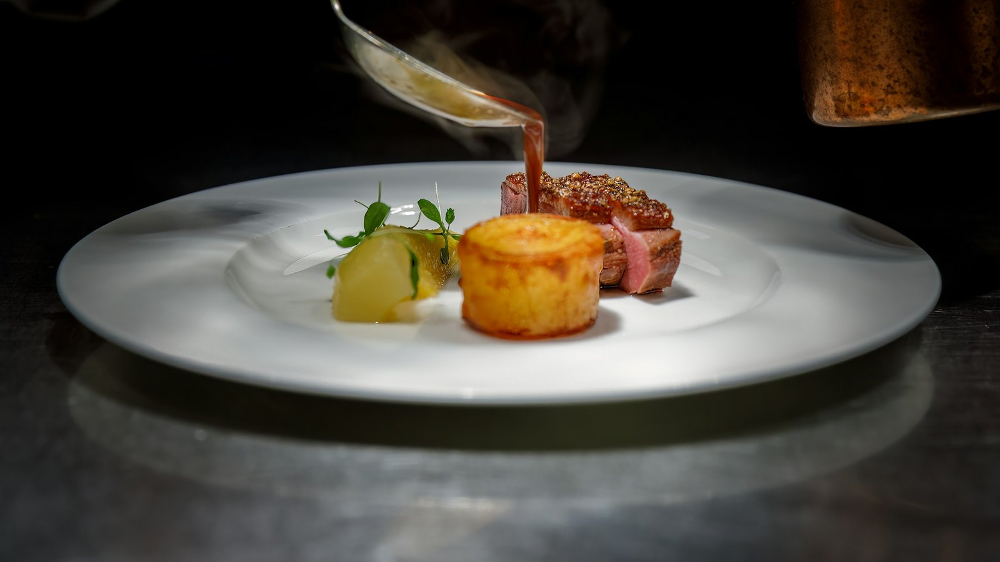

<!-- GENERATED from watch/issues/2026-01-19-responding-to-positive-reviews.yml by scripts/build_watch.py. Edit the data file. -->

```{=html}
<p class="mw-kicker">Marketing Watch · Issue 2 · Week of 19 January 2026</p>
<figure class="mw-hero"><figcaption>The study&#x27;s main test: replies to a restaurant review that said &quot;Dinner was fantastic!&quot;. Photo: Urban Gyllström on Unsplash.</figcaption></figure>
<section class="mw-answer" aria-label="Short answer"><h2>The short answer</h2><p>Say thank you, then gently downplay the compliment: scale down the praise (&quot;We&#x27;re glad your dinner was good&quot;) or credit someone who helped (&quot;Our local suppliers are a big help&quot;). In six experiments, this kind of reply made readers rate the business more highly than no reply, a plain &quot;Thank you!&quot; or a reply that repeated the praise, and 60.8% chose the business that downplayed over one that repeated the compliment. It works because it signals humility.</p></section>
<section class="mw-takeaways"><h2>Key takeaways</h2><ul><li>Choosing between two coffee shops with equally good reviews, 60.8% of 199 people picked the one whose owner downplayed the compliment rather than repeating it.</li><li>Most firms reply the wrong way: of 500 replies to positive Google reviews, 91.4% said thank you and 35.6% repeated the praise, but only 7.8% scaled it down and 11.8% credited the reviewer.</li><li>Downplaying made readers more willing to vote the reply useful (2.18 out of 3, against 1.67 for a plain thank you), which matters for platforms that rank responses.</li><li>It only works with a real shift of credit to someone who was involved: &quot;You made us blush!&quot;, praising staff the reviewer never met, or a lukewarm word such as &quot;alright&quot; did not help, and &quot;alright&quot; hurt.</li></ul></section>
<section id="what-the-researchers-did"><h2>What the researchers did</h2><p>Katherine Lafreniere, Sarah Moore and Mohamad Soltani of the University of Alberta started from a gap between
advice and evidence. Review platforms tell managers to thank the reviewer and repeat something positive from the
review. Earlier academic studies found that replies to positive reviews can hurt ratings and revenue, and
suggested a short &quot;thank you&quot; at most.</p><p>The authors argue that a positive review is a compliment, and that people expect compliments to be answered the
way they are in everyday conversation: agree with the speaker, but stay humble. In a pilot with 602 people,
82.7% said a positive review is the same as complimenting the business, and they expected more gratitude and
more humility from a manager answering a review than from a brand advertising or posting on social media.</p><p>They then coded 500 real replies to 4- and 5-star reviews on Google Local, and ran six experiments with 3,986
participants in total, mostly using one restaurant review (&quot;Dinner was fantastic!&quot;) and testing different
replies from the owner.</p>
<dl class="mw-facts"><div><dt>Field data</dt><dd>500 managerial replies to positive Google Local reviews, coded by two independent coders</dd></div><div><dt>Experiments</dt><dd>6 online experiments, 199 to 1,436 people each</dd></div><div><dt>Measures</dt><dd>Choice between businesses, evaluation of the business, willingness to vote the reply useful, perceived humility of the owner</dd></div><div><dt>Open data</dt><dd>Surveys, data and analyses posted on ResearchBox</dd></div></dl>
</section>
<section id="what-firms-reply-today"><h2>What firms reply today</h2><p>Replies to reviews are becoming common: 21.1% of Google Local reviews posted in 2020 had a reply from the firm,
up from 8.5% in 2016. Yet only 15.21% of positive reviews get one, so most praise goes unanswered.</p><p>When firms do reply, they follow the industry script. Almost every reply said thank you (91.4%) and a third
repeated the compliment (35.6%). Very few downplayed it: 7.8% scaled down the praise, 11.8% credited the
reviewer, and none credited a supplier or another third party.</p>
<figure class="mw-chart" id="chart-coding"><figcaption class="mw-chart-title">What firms write in replies to positive Google reviews</figcaption><div class="mw-chart-svg"><svg viewBox="0 0 680 314" role="img" aria-labelledby="chart-coding-t" font-family="Hanken Grotesk, Arial, sans-serif"><title id="chart-coding-t">What firms write in replies to positive Google reviews</title><line x1="250.0" y1="4" x2="250.0" y2="288" stroke="#dde1e8" stroke-width="1"/><text x="250.0" y="306" font-size="12" text-anchor="middle" fill="#5b6476">0</text><line x1="322.0" y1="4" x2="322.0" y2="288" stroke="#dde1e8" stroke-width="1"/><text x="322.0" y="306" font-size="12" text-anchor="middle" fill="#5b6476">20</text><line x1="394.0" y1="4" x2="394.0" y2="288" stroke="#dde1e8" stroke-width="1"/><text x="394.0" y="306" font-size="12" text-anchor="middle" fill="#5b6476">40</text><line x1="466.0" y1="4" x2="466.0" y2="288" stroke="#dde1e8" stroke-width="1"/><text x="466.0" y="306" font-size="12" text-anchor="middle" fill="#5b6476">60</text><line x1="538.0" y1="4" x2="538.0" y2="288" stroke="#dde1e8" stroke-width="1"/><text x="538.0" y="306" font-size="12" text-anchor="middle" fill="#5b6476">80</text><line x1="610.0" y1="4" x2="610.0" y2="288" stroke="#dde1e8" stroke-width="1"/><text x="610.0" y="306" font-size="12" text-anchor="middle" fill="#5b6476">100</text><g><title>Say thank you: 91.4%</title><text x="238" y="27" font-size="13.5" text-anchor="end" fill="#15203b">Say thank you</text><rect x="250" y="12" width="329.0" height="22" rx="4" fill="#aab3c5"/><text x="587.0" y="28" font-size="13.5" fill="#15203b">91.4%</text></g><g><title>Invite the reviewer back: 38.8%</title><text x="238" y="67" font-size="13.5" text-anchor="end" fill="#15203b">Invite the reviewer back</text><rect x="250" y="52" width="139.7" height="22" rx="4" fill="#aab3c5"/><text x="397.7" y="68" font-size="13.5" fill="#15203b">38.8%</text></g><g><title>Repeat the compliment: 35.6%</title><text x="238" y="107" font-size="13.5" text-anchor="end" fill="#15203b">Repeat the compliment</text><rect x="250" y="92" width="128.2" height="22" rx="4" fill="#aab3c5"/><text x="386.2" y="108" font-size="13.5" fill="#15203b">35.6%</text></g><g><title>Explain service protocol: 14.6%</title><text x="238" y="147" font-size="13.5" text-anchor="end" fill="#15203b">Explain service protocol</text><rect x="250" y="132" width="52.6" height="22" rx="4" fill="#aab3c5"/><text x="310.6" y="148" font-size="13.5" fill="#15203b">14.6%</text></g><g><title>Credit the reviewer (downplay): 11.8%</title><text x="238" y="187" font-size="13.5" text-anchor="end" fill="#15203b" font-weight="600">Credit the reviewer (downplay)</text><rect x="250" y="172" width="42.5" height="22" rx="4" fill="#e0a12a"/><text x="300.5" y="188" font-size="13.5" fill="#15203b" font-weight="600">11.8%</text></g><g><title>Scale down the praise (downplay): 7.8%</title><text x="238" y="227" font-size="13.5" text-anchor="end" fill="#15203b" font-weight="600">Scale down the praise (downplay)</text><rect x="250" y="212" width="28.1" height="22" rx="4" fill="#e0a12a"/><text x="286.1" y="228" font-size="13.5" fill="#15203b" font-weight="600">7.8%</text></g><g><title>Credit a third party (downplay): 0.0%</title><text x="238" y="267" font-size="13.5" text-anchor="end" fill="#15203b" font-weight="600">Credit a third party (downplay)</text><rect x="250" y="252" width="2.0" height="22" rx="4" fill="#e0a12a"/><text x="260.0" y="268" font-size="13.5" fill="#15203b" font-weight="600">0.0%</text></g></svg></div><div class="mw-sr"><table><caption>What firms write in replies to positive Google reviews</caption><tr><th>Group</th><th>Value (%)</th></tr><tr><th scope="row">Say thank you</th><td>91.4</td></tr><tr><th scope="row">Invite the reviewer back</th><td>38.8</td></tr><tr><th scope="row">Repeat the compliment</th><td>35.6</td></tr><tr><th scope="row">Explain service protocol</th><td>14.6</td></tr><tr><th scope="row">Credit the reviewer (downplay)</th><td>11.8</td></tr><tr><th scope="row">Scale down the praise (downplay)</th><td>7.8</td></tr><tr><th scope="row">Credit a third party (downplay)</th><td>0.0</td></tr></table></div><p class="mw-chart-src">500 managerial replies to 4- and 5-star Google Local reviews; categories overlap. Table 3 of the article.</p></figure>
</section>
<section id="what-they-found"><h2>What they found</h2><p>Replies that downplayed the compliment beat every alternative. In the first experiment (455 students), the
restaurant was rated 4.07 out of 5 when the owner wrote &quot;Thank you! We&#x27;re glad your dinner was satisfying. We try
our best, but our local suppliers are a big help&quot;, against 3.87 with no reply, 3.88 with a plain &quot;Thank you!&quot; and
3.90 with &quot;We loved hearing that your dinner was fantastic!&quot;. Readers were also more willing to vote the
downplaying reply useful (2.18 against 1.67 and 1.90 out of 3).</p><p>Each technique works on its own. With 1,000 adults, scaling down the praise (&quot;We&#x27;re glad you had a good night&quot;),
crediting the reviewer (&quot;It was a pleasure to serve you. You made our job easy&quot;) and crediting suppliers all beat
a plain thank you.</p>
<figure class="mw-chart" id="chart-evaluation"><figcaption class="mw-chart-title">Rating of the restaurant after reading the review and the owner&#x27;s reply</figcaption><div class="mw-chart-svg"><svg viewBox="0 0 680 194" role="img" aria-labelledby="chart-evaluation-t" font-family="Hanken Grotesk, Arial, sans-serif"><title id="chart-evaluation-t">Rating of the restaurant after reading the review and the owner&#x27;s reply</title><line x1="250.0" y1="4" x2="250.0" y2="168" stroke="#dde1e8" stroke-width="1"/><text x="250.0" y="186" font-size="12" text-anchor="middle" fill="#5b6476">1</text><line x1="295.0" y1="4" x2="295.0" y2="168" stroke="#dde1e8" stroke-width="1"/><text x="295.0" y="186" font-size="12" text-anchor="middle" fill="#5b6476">1.5</text><line x1="340.0" y1="4" x2="340.0" y2="168" stroke="#dde1e8" stroke-width="1"/><text x="340.0" y="186" font-size="12" text-anchor="middle" fill="#5b6476">2</text><line x1="385.0" y1="4" x2="385.0" y2="168" stroke="#dde1e8" stroke-width="1"/><text x="385.0" y="186" font-size="12" text-anchor="middle" fill="#5b6476">2.5</text><line x1="430.0" y1="4" x2="430.0" y2="168" stroke="#dde1e8" stroke-width="1"/><text x="430.0" y="186" font-size="12" text-anchor="middle" fill="#5b6476">3</text><line x1="475.0" y1="4" x2="475.0" y2="168" stroke="#dde1e8" stroke-width="1"/><text x="475.0" y="186" font-size="12" text-anchor="middle" fill="#5b6476">3.5</text><line x1="520.0" y1="4" x2="520.0" y2="168" stroke="#dde1e8" stroke-width="1"/><text x="520.0" y="186" font-size="12" text-anchor="middle" fill="#5b6476">4</text><line x1="565.0" y1="4" x2="565.0" y2="168" stroke="#dde1e8" stroke-width="1"/><text x="565.0" y="186" font-size="12" text-anchor="middle" fill="#5b6476">4.5</text><line x1="610.0" y1="4" x2="610.0" y2="168" stroke="#dde1e8" stroke-width="1"/><text x="610.0" y="186" font-size="12" text-anchor="middle" fill="#5b6476">5</text><g><title>No reply: 3.87 out of 5</title><text x="238" y="27" font-size="13.5" text-anchor="end" fill="#15203b">No reply</text><rect x="250" y="12" width="258.3" height="22" rx="4" fill="#aab3c5"/><text x="516.3" y="28" font-size="13.5" fill="#15203b">3.87</text></g><g><title>&quot;Thank you!&quot;: 3.88 out of 5</title><text x="238" y="67" font-size="13.5" text-anchor="end" fill="#15203b">&quot;Thank you!&quot;</text><rect x="250" y="52" width="259.2" height="22" rx="4" fill="#aab3c5"/><text x="517.2" y="68" font-size="13.5" fill="#15203b">3.88</text></g><g><title>Thank you + repeat the compliment: 3.90 out of 5</title><text x="238" y="107" font-size="13.5" text-anchor="end" fill="#15203b">Thank you + repeat the compliment</text><rect x="250" y="92" width="261.0" height="22" rx="4" fill="#aab3c5"/><text x="519.0" y="108" font-size="13.5" fill="#15203b">3.90</text></g><g><title>Thank you + downplay the compliment: 4.07 out of 5</title><text x="238" y="147" font-size="13.5" text-anchor="end" fill="#15203b" font-weight="600">Thank you + downplay the compliment</text><rect x="250" y="132" width="276.3" height="22" rx="4" fill="#e0a12a"/><text x="534.3" y="148" font-size="13.5" fill="#15203b" font-weight="600">4.07</text></g></svg></div><div class="mw-sr"><table><caption>Rating of the restaurant after reading the review and the owner&#x27;s reply</caption><tr><th>Group</th><th>Value (out of 5)</th></tr><tr><th scope="row">No reply</th><td>3.87</td></tr><tr><th scope="row">&quot;Thank you!&quot;</th><td>3.88</td></tr><tr><th scope="row">Thank you + repeat the compliment</th><td>3.9</td></tr><tr><th scope="row">Thank you + downplay the compliment</th><td>4.07</td></tr></table></div><p class="mw-chart-src">Experiment 1a, 455 students, 1–5 scale.</p></figure>
</section>
<section id="does-it-change-who-customers-choose"><h2>Does it change who customers choose?</h2><p>Yes. In a test with real stakes, 199 people saw two coffee shops with equally glowing reviews and picked one to
win a $25 gift card for. One owner downplayed the compliment (&quot;Thank you! We try our best, though our local
suppliers sure help!&quot;), the other repeated it (&quot;Thank you for saying that our coffee, staff, and atmosphere are
outstanding!&quot;). Both replies had the same number of words. 60.8% chose the shop that downplayed, whichever
review it was attached to, and that shop was rated more favourably (4.40 against 4.20).</p><p>The reason is humility. Readers saw the downplaying owner as more humble (3.55 against 2.90 out of 4) and as closer
to how an owner ideally should respond, and these perceptions fully explained the better evaluations.</p>
<figure class="mw-chart" id="chart-choice"><figcaption class="mw-chart-title">Which coffee shop did people choose?</figcaption><div class="mw-chart-svg"><svg viewBox="0 0 680 114" role="img" aria-labelledby="chart-choice-t" font-family="Hanken Grotesk, Arial, sans-serif"><title id="chart-choice-t">Which coffee shop did people choose?</title><line x1="250.0" y1="4" x2="250.0" y2="88" stroke="#dde1e8" stroke-width="1"/><text x="250.0" y="106" font-size="12" text-anchor="middle" fill="#5b6476">0</text><line x1="322.0" y1="4" x2="322.0" y2="88" stroke="#dde1e8" stroke-width="1"/><text x="322.0" y="106" font-size="12" text-anchor="middle" fill="#5b6476">20</text><line x1="394.0" y1="4" x2="394.0" y2="88" stroke="#dde1e8" stroke-width="1"/><text x="394.0" y="106" font-size="12" text-anchor="middle" fill="#5b6476">40</text><line x1="466.0" y1="4" x2="466.0" y2="88" stroke="#dde1e8" stroke-width="1"/><text x="466.0" y="106" font-size="12" text-anchor="middle" fill="#5b6476">60</text><line x1="538.0" y1="4" x2="538.0" y2="88" stroke="#dde1e8" stroke-width="1"/><text x="538.0" y="106" font-size="12" text-anchor="middle" fill="#5b6476">80</text><line x1="610.0" y1="4" x2="610.0" y2="88" stroke="#dde1e8" stroke-width="1"/><text x="610.0" y="106" font-size="12" text-anchor="middle" fill="#5b6476">100</text><g><title>Owner repeated the compliment: 39.2%</title><text x="238" y="27" font-size="13.5" text-anchor="end" fill="#15203b">Owner repeated the compliment</text><rect x="250" y="12" width="141.1" height="22" rx="4" fill="#aab3c5"/><text x="399.1" y="28" font-size="13.5" fill="#15203b">39.2%</text></g><g><title>Owner downplayed the compliment: 60.8%</title><text x="238" y="67" font-size="13.5" text-anchor="end" fill="#15203b" font-weight="600">Owner downplayed the compliment</text><rect x="250" y="52" width="218.9" height="22" rx="4" fill="#e0a12a"/><text x="476.9" y="68" font-size="13.5" fill="#15203b" font-weight="600">60.8%</text></g></svg></div><div class="mw-sr"><table><caption>Which coffee shop did people choose?</caption><tr><th>Group</th><th>Value (%)</th></tr><tr><th scope="row">Owner repeated the compliment</th><td>39.2</td></tr><tr><th scope="row">Owner downplayed the compliment</th><td>60.8</td></tr></table></div><p class="mw-chart-src">Experiment 2, 199 adults choosing a shop for a $25 gift card draw; replies of equal length.</p></figure>
</section>
<section id="three-ways-to-get-it-wrong"><h2>Three ways to get it wrong</h2><p>The last three experiments show that downplaying works only when readers can tell the owner is genuinely passing
on credit.</p><p>Saying you are flattered is not enough. &quot;Thank you! You made us blush!&quot; did no better than a plain thank you.
Credit has to go to someone involved. Crediting the suppliers lifted evaluations (4.17), but crediting &quot;our
hostesses&quot; for a comment about the appetisers did not (3.76). And the scaled-down word must still be positive. In
the largest experiment (1,436 people), &quot;We&#x27;re glad your dinner was satisfying&quot; beat repeating the praise (4.07
against 3.99), but &quot;We&#x27;re glad your night was alright&quot; made things worse (3.70): readers read it as disagreement
with the reviewer.</p>
<figure class="mw-chart" id="chart-words"><figcaption class="mw-chart-title">How far to scale down the praise for &quot;Dinner was fantastic!&quot;</figcaption><div class="mw-chart-svg"><svg viewBox="0 0 680 154" role="img" aria-labelledby="chart-words-t" font-family="Hanken Grotesk, Arial, sans-serif"><title id="chart-words-t">How far to scale down the praise for &quot;Dinner was fantastic!&quot;</title><line x1="250.0" y1="4" x2="250.0" y2="128" stroke="#dde1e8" stroke-width="1"/><text x="250.0" y="146" font-size="12" text-anchor="middle" fill="#5b6476">1</text><line x1="295.0" y1="4" x2="295.0" y2="128" stroke="#dde1e8" stroke-width="1"/><text x="295.0" y="146" font-size="12" text-anchor="middle" fill="#5b6476">1.5</text><line x1="340.0" y1="4" x2="340.0" y2="128" stroke="#dde1e8" stroke-width="1"/><text x="340.0" y="146" font-size="12" text-anchor="middle" fill="#5b6476">2</text><line x1="385.0" y1="4" x2="385.0" y2="128" stroke="#dde1e8" stroke-width="1"/><text x="385.0" y="146" font-size="12" text-anchor="middle" fill="#5b6476">2.5</text><line x1="430.0" y1="4" x2="430.0" y2="128" stroke="#dde1e8" stroke-width="1"/><text x="430.0" y="146" font-size="12" text-anchor="middle" fill="#5b6476">3</text><line x1="475.0" y1="4" x2="475.0" y2="128" stroke="#dde1e8" stroke-width="1"/><text x="475.0" y="146" font-size="12" text-anchor="middle" fill="#5b6476">3.5</text><line x1="520.0" y1="4" x2="520.0" y2="128" stroke="#dde1e8" stroke-width="1"/><text x="520.0" y="146" font-size="12" text-anchor="middle" fill="#5b6476">4</text><line x1="565.0" y1="4" x2="565.0" y2="128" stroke="#dde1e8" stroke-width="1"/><text x="565.0" y="146" font-size="12" text-anchor="middle" fill="#5b6476">4.5</text><line x1="610.0" y1="4" x2="610.0" y2="128" stroke="#dde1e8" stroke-width="1"/><text x="610.0" y="146" font-size="12" text-anchor="middle" fill="#5b6476">5</text><g><title>Neutral (&quot;alright&quot;): 3.70 out of 5</title><text x="238" y="27" font-size="13.5" text-anchor="end" fill="#15203b">Neutral (&quot;alright&quot;)</text><rect x="250" y="12" width="243.0" height="22" rx="4" fill="#aab3c5"/><text x="501.0" y="28" font-size="13.5" fill="#15203b">3.70</text></g><g><title>Same praise (&quot;fantastic&quot;): 3.99 out of 5</title><text x="238" y="67" font-size="13.5" text-anchor="end" fill="#15203b">Same praise (&quot;fantastic&quot;)</text><rect x="250" y="52" width="269.1" height="22" rx="4" fill="#aab3c5"/><text x="527.1" y="68" font-size="13.5" fill="#15203b">3.99</text></g><g><title>Scaled down (&quot;satisfying&quot;): 4.07 out of 5</title><text x="238" y="107" font-size="13.5" text-anchor="end" fill="#15203b" font-weight="600">Scaled down (&quot;satisfying&quot;)</text><rect x="250" y="92" width="276.3" height="22" rx="4" fill="#e0a12a"/><text x="534.3" y="108" font-size="13.5" fill="#15203b" font-weight="600">4.07</text></g></svg></div><div class="mw-sr"><table><caption>How far to scale down the praise for &quot;Dinner was fantastic!&quot;</caption><tr><th>Group</th><th>Value (out of 5)</th></tr><tr><th scope="row">Neutral (&quot;alright&quot;)</th><td>3.7</td></tr><tr><th scope="row">Same praise (&quot;fantastic&quot;)</th><td>3.99</td></tr><tr><th scope="row">Scaled down (&quot;satisfying&quot;)</th><td>4.07</td></tr></table></div><p class="mw-chart-src">Experiment 5, 1,436 adults, three wordings per level, 1–5 scale.</p></figure>
</section>
<section id="how-to-apply-it"><h2>How to apply it</h2><ol class="mw-steps"><li><strong>Reply to positive reviews.</strong> Most positive reviews get no answer. A well-worded reply beat no reply in this research, so answering praise is an easy way to stand out from similarly rated competitors.</li><li><strong>Open with thanks.</strong> Start with a short token of appreciation (&quot;Thank you!&quot;). It signals that you agree with the reviewer, which readers expect.</li><li><strong>Scale down the praise one step.</strong> Answer &quot;fantastic&quot; with &quot;good&quot; or &quot;satisfying&quot;, not with the same superlative and not with a neutral word such as &quot;alright&quot; or &quot;reasonable&quot;.</li><li><strong>Or credit someone who was part of it.</strong> Thank the reviewer (&quot;It was a pleasure to serve you&quot;) or a contributor who shaped the experience (&quot;Our local suppliers are a big help&quot;). Do not use it to promote unrelated staff or departments.</li><li><strong>Do not stop at flattery.</strong> &quot;You made us blush!&quot; or &quot;You&#x27;re too kind&quot; show discomfort with praise but do not pass on any credit, and did not help.</li><li><strong>Brief your team and test.</strong> Write two or three approved templates for each type of review, ask whoever manages your listings to use them, and check whether replies attract more &quot;helpful&quot; votes.</li></ol></section>
<section id="what-to-expect"><h2>What to expect</h2><ul class="mw-list"><li><strong>Small, reliable lifts.</strong> Evaluation gains were around 0.2 points on a 5-point scale, but they repeated across six experiments, and in a direct choice the downplaying business won 61 to 39.</li><li><strong>More engagement with your replies.</strong> People were clearly more willing to vote downplaying replies useful, which can push them up on platforms that rank responses.</li><li><strong>Little cost.</strong> The winning replies were one or two sentences long. Length was held constant in two experiments, so the effect is not about effort.</li><li><strong>Better than staying silent.</strong> Earlier research found that replies to praise can hurt; here a downplaying reply did better than no reply at all.</li></ul></section>
<section id="where-it-does-not-work"><h2>Where it does not work</h2><ul class="mw-list"><li><strong>Simulated settings.</strong> Most experiments used a restaurant or coffee-shop scenario online, with students or CloudResearch panels. Results may differ for other categories and real review pages.</li><li><strong>Readers, not reviewers.</strong> The studies measured people reading reviews. How the reviewer feels about a downplayed reply is not yet known; early evidence suggests crediting the reviewer matters most to them.</li><li><strong>Mixed reviews.</strong> The advice is for clearly positive reviews. 3- and 4-star reviews that mix praise and criticism need a reply that addresses both.</li><li><strong>Personal brands.</strong> When the business is one person, such as a trainer or artist, the norms may differ.</li></ul></section>
<section id="questions"><h2>Questions marketers ask</h2><div class="mw-faq"><h3>How should a business respond to a positive review?</h3><p>Thank the reviewer, then downplay the compliment: scale down the praise one step (&quot;We&#x27;re glad dinner was good&quot;) or credit someone involved, such as the reviewer or a supplier. In a Journal of Marketing study, these replies improved evaluations of the business and readers&#x27; engagement compared with no reply, a plain thank you, or repeating the compliment.</p></div><div class="mw-faq"><h3>Is it bad to repeat the customer&#x27;s compliment in a review reply?</h3><p>It is less effective. When two coffee shops had equally positive reviews, 60.8% of people chose the shop whose owner downplayed the compliment over the one whose owner repeated it, and they rated it higher (4.40 against 4.20 out of 5).</p></div><div class="mw-faq"><h3>Is a simple &quot;thank you&quot; enough when replying to a 5-star review?</h3><p>It is safe but not the best option. In Experiment 1a, a plain &quot;Thank you!&quot; gave the same evaluation as no reply (3.88 against 3.87 out of 5), while a reply that thanked and downplayed the praise scored 4.07.</p></div><div class="mw-faq"><h3>Why does downplaying a compliment work?</h3><p>Readers see the manager as more humble, and humility is what people expect when someone receives a compliment. In the study, perceived humility and closeness to the ideal response fully explained the better evaluations.</p></div><div class="mw-faq"><h3>What should managers avoid when replying to positive reviews?</h3><p>Saying &quot;You made us blush!&quot; without passing on credit, praising staff who were not part of the reviewer&#x27;s experience, and using a neutral word such as &quot;alright&quot;, which readers took as disagreeing with the reviewer and which lowered evaluations (3.70 against 3.99 for repeating the praise).</p></div></section>
<section id="also-new"><h2>Also new this week</h2><div class="mw-also"><article><p class="mw-also-src"><em>Journal of Advertising</em> · 2026</p><h3><a href="https://doi.org/10.1080/00913367.2025.2609287">Can aggressive humor pay off in brand-to-brand dialogues on social media?</a></h3><p class="mw-also-au">Béal, M., &amp; Nguyen, N.</p><p>Brands roasting rivals on social media is usually advised against, yet some do it to great effect. Across four experiments, mocking a rival worked as well as friendly humour with people who identify with the brand doing the teasing, but it stopped their goodwill spilling over to the rival, and it made the rival&#x27;s own fans feel less superior and think less of the rival. Aggressive banter is a tool for rallying your own base, not for winning over your competitor&#x27;s customers.</p></article><article><p class="mw-also-src"><em>Journal of Interactive Marketing</em> · 2026</p><h3><a href="https://doi.org/10.1177/10949968251366265">Artificial intelligence chatbots versus human agents in customer satisfaction: The role of warmth and competence</a></h3><p class="mw-also-au">Zhang, Y., Özsomer, A., Gürhan Canlı, Z., &amp; Baghirov, F.</p><p>Using 887 real chat transcripts from an investment firm and an experiment with 989 people, the authors find that AI chatbots satisfy customers more in transactional, task-focused chats because they come across as competent, while human agents do better in relational conversations because they come across as warm, which also helped retention. Route routine queries to the bot and relationship moments to people.</p></article></div></section>
<section id="source" class="mw-source"><h2>Source</h2><p class="mw-cite">Lafreniere, K. C., Moore, S. G., &amp; Soltani, M. (2026). Giving thanks: How managers should respond to compliments in positive word of mouth. <em>Journal of Marketing</em>. <a href="https://doi.org/10.1177/00222429251408347">https://doi.org/10.1177/00222429251408347</a></p><p class="mw-note">This brief is written for practitioners from the published article. Open access (CC BY 4.0): free to read at the publisher. Numbers are as reported by the authors; read the article for full methods.</p></section>
<div class="mw-author"><div><p><strong>Bruno Schivinski</strong> is Associate Professor of Marketing at Gdańsk University of Technology. He studies how consumers engage with brands in digital and social media.</p><p><a href="../../../index.html">About Bruno</a> · <a href="../../index.html">All Marketing Watch issues</a> · <a href="../../index.xml">RSS feed</a></p></div></div>
<nav class="mw-pn" aria-label="More issues"><a class="mw-prev" href="../generative-ai-ad-images/index.html"><span>Previous issue</span>Generative AI images that actually engage</a></nav>
<p class="mw-published">Published 11 October 2026.</p>
```
